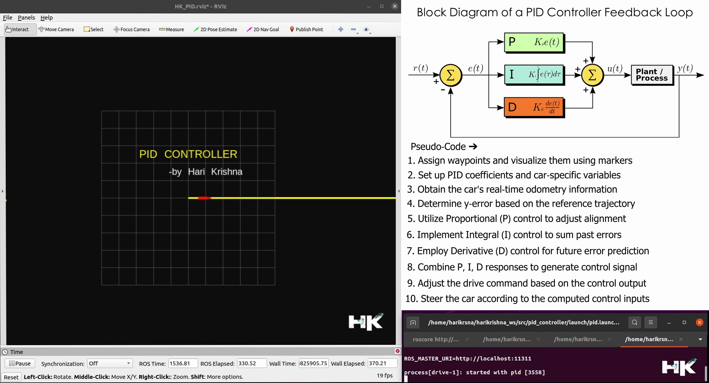

  <h1>PID Controller w/ ROS Mobile Robot</h1>

 

  

---------------------------------------------

##   ★ What is PID Controller:
A PID controller is a widely used feedback controller in control systems. PID stands for Proportional, Integral, and Derivative, which are the three basic coefficients used in this controller to maintain the desired output of the system.

Here's what each component does:

1. **Proportional (P):** This part of the controller reacts to the current error, which is the difference between the desired setpoint and the actual output. The proportional term produces an output that is proportional to the current error. A higher proportional gain will increase the system's responsiveness but can also lead to an unstable system with increased oscillation.

2. **Integral (I):** The integral component sums the past errors over time. If the error has been present for a prolonged period, the integral term increases, applying a stronger action through the controller to eliminate the error. This part is responsible for removing any residual steady-state error that the proportional part leaves behind; however, too much integral action can lead to instability and oscillations as well.

3. **Derivative (D):** This part of the controller responds to the rate of change of the error, attempting to predict future error based on its current rate. It helps to dampen the system, reducing overshoot and improving stability.

  

The PID controller combines these three components to produce a control signal to drive the system towards its setpoint without oscillation or steady-state error. The exact influence of each component (P, I, and D) is determined by their respective coefficients, which are tuned according to the specific needs of the system being controlled.

The PID control algorithm is used in various applications, from simple home appliances to complex industrial systems, due to its simplicity and robustness. It helps to ensure that the output of a system (like the speed of a motor, the temperature of an oven, the position of a drone, etc.) follows the input command as closely as possible, even in the presence of disturbances or changes in the environment.

---------------------------------------------

##  ★ Controller with PID Feedback System:
    • **Improved Stability:** A PID controller can stabilize a system that might otherwise be unstable. It can be tuned to dampen 
                          oscillations and ensure that the system settles into the desired state more quickly and remains 
                          stable over time.
                          
    • **Reduced Steady-State Error:** The integral component of a PID controller helps eliminate steady-state error, the persistent 
                          difference between the system’s output and the desired setpoint, by integrating  the error over time 
                          and applying a corrective action.
                                  
    • **Enhanced Responsiveness:** The proportional term allows the system to respond proportionally to the error. If the system 
                          drifts from the desired setpoint, the proportional term provides a correction to bring it back, 
                          improving the responsiveness of the system to changes.
                               
    • **Predictive Action:** The derivative term anticipates future errors by calculating the rate of change of the error. 
                          This predictive action can reduce overshooting and undershooting by applying braking force to the 
                          system's response, improving the overall control and response time.
                          
    • **Adaptability:** PID controllers can be adapted to different systems with appropriate tuning of the P, I, and D parameters. 
                          They are versatile enough to be used in a wide range of applications and different types of processes.

    • **Simplicity and Cost-effectiveness:** PID controllers are relatively simple to understand and implement, which makes them 
                          a cost-effective solution for many control problems. They do not require complex mathematics 
                          or modeling of the system to be controlled.
                          
---------------------------------------------

##  ★ Controller without PID Feedback System:
    • **No Correction for Disturbances:** Without a feedback control system, a process can be significantly affected by disturbances 
                          or changes in the environment, leading to deviation from the setpoint.
                          
    • **Oscillations and Instability:** Systems without proper control can oscillate and may not settle at a desired value, 
                          leading to instability.
                                  
    • **Manual Intervention Required:** Without automatic control, manual intervention may be required to adjust the system to reach
                          and maintain the desired output, which is less efficient and more error-prone.
                               
    • **Inability to Compensate for System Dynamics:** Without an integral component, steady-state errors cannot be corrected, which 
                          could lead to persistent offsets from the desired output.
                          
    • **Increased Steady-State Error:** PID controllers can be adapted to different systems with appropriate tuning of the PID 
                          parameters. They are versatile enough to be used in a wide range of applications and different types of processes.

    • **Unpredictable System Response:** Without the predictive action of the derivative term, the system may respond in an 
                          unpredictable manner to changing conditions or sudden inputs.

---------------------------------------------

##  ★ PID Controller in Action:

  

---------------------------------------------

##  ★ Testing and Results:
Using PID controller to steering input, I achieved over 98% accuracy in my path tracking tests conducted in ROS. Below is a link where you can view a video demonstrating how precisely the controller follows the designated path.

---------------------------------------------

##  ★ My Project Video Demonstration:

  

---------------------------------------------
